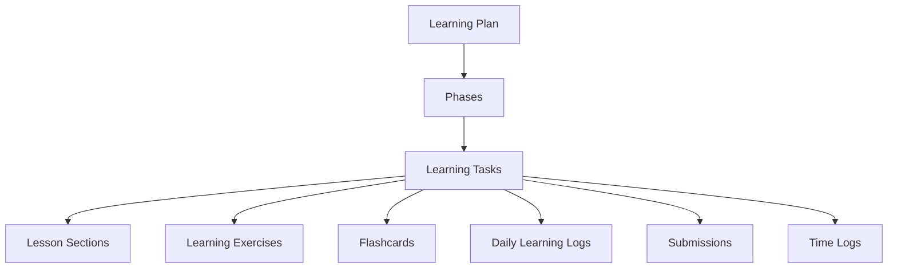

# Learning & Productivity Tracker Module

The **Learning & Productivity Tracker** is a central subsystem within the Portfolio application designed to showcase a live, verifiable proof-of-work history of technical skill acquisition. 

It functions both as a **private dashboard** for the portfolio owner (Admin) to manage roadmaps, track study time, practice coding, and write reflection journals, and as a **public-facing roadmap** for visitors (e.g., recruiters, developers) to explore the author's learning journey, read lesson content, view time stats, and leave feedback.

---

## 1. High-Level Architecture & Core Concept

The module is structured as a hierarchical data model split across two distinct permission domains:



### Roles and Permissions Matrix

| Feature | Admin (Portfolio Owner) | Visitor (Public User) | Description |
| :--- | :---: | :---: | :--- |
| **View Public Plans & Roadmaps** | ✅ | ✅ | Access learning plans, status, target completion dates, and overall progress. |
| **View Hidden/Archived Plans** | ✅ | ❌ | View drafting or private plans (`includeHidden=true`). |
| **Manage Plans, Phases, Tasks** | ✅ | ❌ | Create, update, delete, or bulk import roadmaps. |
| **Read Lessons & Study Content** | ✅ | ✅ | View theoretical sections, resources, and starter code. |
| **Interactive Code Playground** | ✅ | ❌ (View Only) | Execute Python/JS code, test cases, and save solutions. |
| **Study Timer / Time Tracking** | ✅ | ❌ | Start/stop timers, track active study sessions. |
| **Log Daily Reflections** | ✅ | ❌ | Log daily study topics, project connection, and confidence. |
| **Comments / Questions** | ✅ (Admin Flag) | ✅ (Guest Name) | Ask questions on specific tasks; participate in feedback loops. |

---

## 2. Domain Data Models (Schema definitions)

These interfaces are defined in [learningApi.ts](file:///c:/Users/VAIBHAV/MERN%20Portfolio%20Tracker/react-portfolio-frontend/src/utils/learningApi.ts):

### LearningPlan
Represents a major roadmap topic (e.g., *JavaScript Fundamentals*, *Data Structures & Algorithms*).
```typescript
export interface LearningPlan {
    _id: string;
    title: string;
    description?: string;
    goals?: string[];
    status: 'active' | 'completed' | 'paused' | 'archived';
    isPublic?: boolean;
    startDate?: string;
    targetEndDate?: string;
    actualEndDate?: string;
    createdAt: string;
    updatedAt: string;
}
```

### Phase
Groups tasks within a plan into logical milestones (e.g., *Phase 1: Basic Syntaxes*, *Phase 2: Async Operations*).
```typescript
export interface Phase {
    _id: string;
    title: string;
    description?: string;
    order: number;
    planId: string;
    status: 'not-started' | 'in-progress' | 'completed';
    createdAt: string;
    updatedAt: string;
}
```

### LearningTask
A specific unit of study containing theory lessons, practice tasks, resources, and evaluation tools.
```typescript
export interface LearningTask {
    _id: string;
    priority?: 'low' | 'medium' | 'high';
    title: string;
    description?: string;
    aim?: string;
    lessonSections?: LessonSection[];
    exercise?: LearningExercise;
    exercises?: LearningExercise[];
    resources?: string[];
    flashcards?: Flashcard[];
    confidenceScore?: number;
    order?: number;
    planId: string;
    phaseId?: string;
    dueDate?: string;
    notes?: LearningTaskNote[];
    status: 'pending' | 'not-started' | 'in-progress' | 'learning' | 'practiced' | 'revised' | 'completed';
    completedAt?: string;
    totalTimeSpent: number;
    createdAt: string;
    updatedAt: string;
}
```

### Supporting Structs
* **LessonSection**: Individual theoretical modules inside a task.
  ```typescript
  export interface LessonSection {
      title: string;
      content: string; // HTML markup supported
      order: number;
  }
  ```
* **LearningExercise**: Setup specs for interactive coding exercises.
  ```typescript
  export interface LearningExercise {
      type: 'coding' | 'reading' | 'quiz' | 'project' | 'debugging';
      language?: 'javascript' | 'python';
      prompt: string;
      starterCode?: string;
      expectedOutput?: string;
      testCases?: Array<{ input: string; expectedOutput: string }>;
      hints?: string[];
      solution?: string;
      difficulty?: 'easy' | 'medium' | 'hard';
      order?: number;
  }
  ```
* **Flashcard**: Spaced repetition Q&A structure.
  ```typescript
  export interface Flashcard {
      question: string;
      answer: string;
  }
  ```
* **DailyLearningLog**: Reflection metrics registered upon studying.
  ```typescript
  export interface DailyLearningLog {
      _id: string;
      planId: string;
      taskId?: string | { _id: string; title: string };
      date: string;
      lessonSummary?: string;
      practiceSummary?: string;
      projectConnection?: string;
      doubts?: string;
      notes?: string;
      confidenceScore?: number;
      createdAt: string;
      updatedAt: string;
  }
  ```
* **LearningSubmission**: Evaluated outputs of interactive code practice attempts.
  ```typescript
  export interface LearningSubmission {
      _id: string;
      planId: string;
      phaseId?: string;
      taskId: string;
      language: 'javascript' | 'python';
      code: string;
      output?: string;
      error?: string;
      status: 'saved' | 'success' | 'error' | 'timeout';
      executionTimeMs?: number;
      createdAt: string;
      updatedAt: string;
  }
  ```

---

## 3. Visitor / Guest User Workflow

Visitors view the portfolio pages to evaluate the author's skillset.

1. **Dashboard Discovery** (`/learning`):
   * Visitors browse all public plans, observing titles, descriptions, goals list, dates, and current status badges (e.g. `active`, `completed`).
2. **Roadmap Insights** (`/learning/:planId`):
   * Shows global stats for the plan: Progress %, completed task ratio, total active time spent studying this topic today, this week, and overall.
   * Lists phases in logical order. Within each phase, progress bars display what percentage of tasks are finished.
   * Prominently highlights the "Current Lesson" shortcut card for recruiters to see exactly what the author is studying today.
3. **Study & Verification Hub** (`/task/:taskId`):
   * **Learn Tab**: Visitors read lessons, review core theoretical sections, and browse resources.
   * **Practice Tab**: Displays the coding exercise. Visitors see the prompt, difficulty, hints, and starter code. Since they are guests, a message informs them: *"Log in as admin to save or run coding attempts."*
   * **Reflect Tab**: A chronological board of discussion. Visitors can type questions or reviews (inputting a custom guest author name) to engage with the author.

---

## 4. Admin (Portfolio Owner) Workflow

The admin is the active student managing their educational workspace.

### 4.1 Admin Management Panel (`/admin/dashboard` -> Learning Tab)
Admins access `LearningManagementPanel.tsx` to handle CRUD operations on their roadmap elements:
* **Plan Control**:
  * Create plans with description and target dates.
  * Edit metadata or delete plans.
  * Bulk import plans using JSON format.
  * Seed a roadmap directly (e.g., standard *Python & Algo Roadmap* preset).
* **Phase Alignment**:
  * Add milestones to group tasks and designate order sequences.
* **Task Drafting**:
  * Build rich lessons: Integrates a **Tiptap Rich-Text Editor** to build formatted lessons with tables, formatted links, blockquotes, code-blocks, and inline images.
  * Define exercises: Setup language inputs, code boilerplate, test cases, and solutions.
  * Re-order tasks and drag-and-drop between phases.

### 4.2 Study Mode & Logging (`/task/:taskId`)
* **Study Timer**:
  * An active timer widget floating on the sidebar. Admins click "Start Session" to initiate. It automatically handles API updates, logging active seconds to the server.
  * Tracks custom time entries if manual logging is needed.
* **Coding Environment**:
  * Admins utilize the code playground inside the **Practice Tab**.
  * Input code solutions directly. Clicking **Run Code** executes the logic, running test cases on the backend and outputting standard error/out streams.
  * **Save Attempt** registers attempts to preserve coding history.
* **Reflections Logging**:
  * After completing a task, the admin fills in a daily reflection draft (lesson summary, practice summaries, doubts, connection to project).
  * Assigns a 1-5 confidence score. Submitting creates a `DailyLearningLog` linkable to active portfolio progress metrics.
* **Interaction**:
  * View guest comments, toggle admin responder badges, and answer recruiter questions directly.

---

## 5. API Client Specifications

Frontend modules interface with the backend via REST endpoints wrapped in the utilities below:

### `learningApi` ([learningApi.ts](file:///c:/Users/VAIBHAV/MERN%20Portfolio%20Tracker/react-portfolio-frontend/src/utils/learningApi.ts))
* `getAllPlans(includeHidden?: boolean)`: `GET /learning/plans`
* `getPlanById(id: string, includeHidden?: boolean)`: `GET /learning/plans/:id`
* `createPlan(plan)`: `POST /learning/plans`
* `updatePlan(id, plan)`: `PUT /learning/plans/:id`
* `deletePlan(id)`: `DELETE /learning/plans/:id`
* `seedPythonAlgoRoadmap()`: `POST /learning/seed/python-algo-roadmap`
* `getDailyLogs(planId, limit)`: `GET /learning/plans/:planId/daily-logs`
* `createDailyLog(planId, log)`: `POST /learning/plans/:planId/daily-logs`
* `createPhase(phase)`: `POST /learning/phases`
* `updatePhase(id, phase)`: `PUT /learning/phases/:id`
* `deletePhase(id)`: `DELETE /learning/phases/:id`
* `createTask(task)`: `POST /learning/tasks`
* `updateTask(id, task)`: `PUT /learning/tasks/:id`
* `deleteTask(id)`: `DELETE /learning/tasks/:id`
* `addTaskNote(id, content)`: `POST /learning/tasks/:id/notes`
* `getTaskSubmissions(taskId)`: `GET /learning/tasks/:taskId/submissions`
* `createSubmission(taskId, submission)`: `POST /learning/tasks/:taskId/submissions`
* `runSubmission(taskId, payload)`: `POST /learning/tasks/:taskId/run`

### `timeApi` ([learningApi.ts](file:///c:/Users/VAIBHAV/MERN%20Portfolio%20Tracker/react-portfolio-frontend/src/utils/learningApi.ts))
* `getDailyStats()`: `GET /learning/time/stats/daily`
* `getWeeklyStats()`: `GET /learning/time/stats/weekly`
* `getPlanStats(planId)`: `GET /learning/time/stats/plans/:planId`
* `getActiveTimer(taskId)`: `GET /learning/time/timers/active?taskId=:taskId`
* `startTimer(taskId)`: `POST /learning/time/timers/start`
* `stopTimer(timerId)`: `POST /learning/time/timers/stop`

### `commentApi` ([learningApi.ts](file:///c:/Users/VAIBHAV/MERN%20Portfolio%20Tracker/react-portfolio-frontend/src/utils/learningApi.ts))
* `getTaskComments(taskId)`: `GET /learning/comments/tasks/:taskId`
* `addComment(taskId, content, author)`: `POST /learning/comments/tasks/:taskId`
* `addAdminComment(taskId, content, author)`: `POST /learning/comments/tasks/:taskId/admin`

---

## 6. Recommendations & Feature Suggestions

To take the Learning Tracker module to the next level of security, engagement, and usability, consider the following enhancements:

### 💡 1. Recruiters & Guests Interactive Sandbox (Demo Mode)
* **Current State**: Guests are completely blocked from running code exercises (`disabled={!isAdmin}`). This prevents recruiters from interacting with the author's exercises.
* **Suggestion**: Allow users to run code client-side using **WebAssembly**.
  * Use **Pyodide** for Python execution and run Javascript inside a sandboxed, restricted **Web Worker** directly in the user's browser.
  * This allows guests to test out the exercises and see outputs without calling the server, enhancing the portfolio's interactive showcase value.

### 💡 2. Integrate Monaco Editor or CodeMirror
* **Current State**: The code editor in `CodeExerciseEditor.tsx` uses a simple HTML `<textarea>`. It lacks formatting, syntax highlighting, autocomplete, and proper tab indent support.
* **Suggestion**: Integrate `@monaco-editor/react` (VS Code engine) or `CodeMirror`. This immediately transforms the practice section into a sleek, premium, professional coding editor with:
  * Full syntax highlighting for JS/Python.
  * Code completion, auto-close brackets, and auto-formatting.
  * Line numbers and minimaps.

### 💡 3. Spaced Repetition (Flashcard) UI
* **Current State**: The backend schemas and domain types declare `Flashcard` properties, but there is no frontend screen for studying them.
* **Suggestion**: Build a **Flashcards Review Deck** component inside the task or plan page.
  * Use CSS 3D transforms / Framer Motion for smooth card-flip animations.
  * Implement the **SuperMemo-2 (SM-2)** algorithm. Provide buttons like *Again, Hard, Good, Easy* to dynamically calculate interval schedules and review logs, making study sessions highly efficient.

### 💡 4. Secure Backend Execution Sandbox (Docker / Judge0)
* **Current State**: Code runs on the core application server (e.g. Render host). Executing user-written files locally on the hosting runtime presents critical security vulnerabilities (RCE, files scraping, DoS).
* **Suggestion**: Secure the server execution layer:
  * Route code submissions to a dedicated **Judge0 API** service or spin up isolated, ephemeral AWS Lambda functions.
  * If self-hosting, execute code in temporary, read-only Docker containers with constrained network access and memory limits.

### 💡 5. Heatmap Activity Grid (Contribution Graph)
* **Current State**: Analytics are limited to simple stats cards and bar charts.
* **Suggestion**: Create a **GitHub-style study contribution grid** showing daily study minutes.
  * Green blocks representing the frequency/intensity of study sessions.
  * Recruiter-facing visualization showing consistent, daily learning logs, reinforcing the developer's work ethic and commitment.
